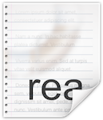

# Luna GUI
Das Luna GUI sorgt für die Aktualisierung von Code-Snippets innerhalb der Sublime-Text-Entwicklungsumgebung, um effizienter Code 
fuer den Taschenrechner zu erstellen und besitzt einen integrierten Compiler, der das Erstellen und übertragen von tns-Dateien 
ermöglicht.
Da das Drag&Drop-Verfahren simuliert wird, müssen Positionen für Buttons und Felder festgelegt werden.
Ein OffsetFinder-Wizard im Tab "Testing" hilft beim Ermitteln der relativen Fenster- und Buttonpositionen, die gesetzt werden müssen,
um Dateien automatisch auf den Emulator übertragen zu können.

Hinweise:
- Reload-Button => Gelber Button, der im Dateiuebertragungsfenster steht
- Zielordner-Textfeld => unter Einstellungen->Dateiübertragung das Textfeld neben "Ziel-Ordner"
- Taskleistensymbol => von Firebird

## CodeAnalyse
Aktuelle Funktionen:
- MoonSharp Lua-Compiler
- Eventkonvertierung
- Deklarationsüberprüfung
- Funktions-Attribute: ScreenUpdate, Debug, Thread
- Feld-Attribute: Debug

Zufünftige:
- Live-Debugging (eventuell)


##Attribute - Ursprung: Microsoft.Reflection
Attribut-Beispiel:
```lua
function on.paint( gc )
Funktionsname()
end

[Debug]
function Funktionsname()
a = 6
tostring(a)
end
```
im Hintergrund generiert zu
```lua
function onpaint( gc )
gc:drawString("[DebugActive] "..__errorHandleVar788398410, 150, 5, "top")
Funktionsname()
end
function Funktionsname788398410 ()
a = 6
tostring(a)
end
local __errorHandleVar788398410 = ""
function onFunction788398410_Fail(err)
__errorHandleVar788398410 = tostring(err)
end
function Funktionsname()
xpcall( Funktionsname788398410, onFunction788398410_Fail )
end
```
___________________________________________
```lua
[Thread]
function funcccccccccccc()
a = a+1
if a > 50 then a = 0 end
platform.window:invalidate()
return a
end
```
im Hintergrund generiert zu
```lua
function ThreadCloneFunc_funcccccccccccc()
local funcccccccccccc1458243235 = coroutine.wrap(function ()
a = a+1
if a > 50 then a = 0 end
platform.window:invalidate()
coroutine.yield(a)
end)
return funcccccccccccc1458243235()
end
function funcccccccccccc()
return ThreadCloneFunc_funcccccccccccc()
end
```

##Screenshots


##Fehler bei Windows XP
Unable to cast COM object of type System.__ComObject to interface type X 
- => Lösung:
- regsvr32 "C:\Program Files\Internet Explorer\ieproxy.dll"

HttpWebrequests können nicht zu Github aufgebaut werden.
- => Keine Codesnippet-Updates

##Hinweise
Um das GUI in dem DevelopmentMode zu bringen, muss eine LunaGUI.debug-Datei im selben Verzeichnis existieren.

##Setup
Systemanforderungen:
.Net 4.0 Framework oder neuer

Download (nur .rar):
[Windows XP/Vista/7/8/10](https://github.com/DanThePman/Luna-GUI/blob/master/Luna%20GUI/bin/x86/)